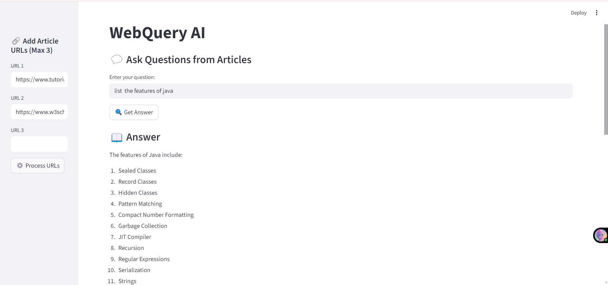
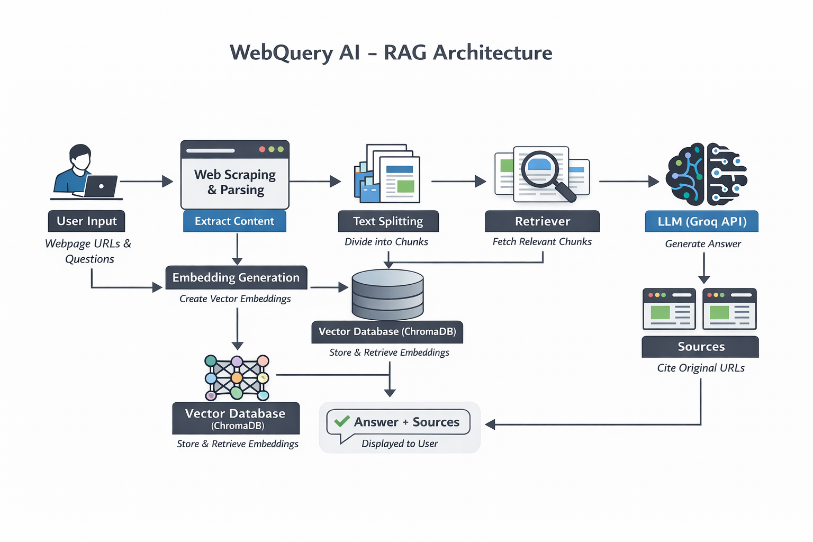

# 🌐 WebQuery AI – Ask Questions from Any Webpage

WebQuery AI is a Retrieval-Augmented Generation (RAG) based web application that allows users to provide static webpage URLs and ask questions based on the content of those pages.

---

## 📸 Application UI



---

## 🚀 Features

- Accepts static webpage URLs  
- Extracts and processes webpage content  
- Splits text into chunks for better retrieval  
- Stores embeddings using Chroma vector database  
- Generates context-aware answers using LLM  
- Interactive Streamlit UI  
- Progress status display during parsing  

---

## 🏗️ Tech Stack

- **Python**
- **Streamlit** – Web interface  
- **LangChain** – RAG pipeline  
- **ChromaDB** – Vector database  
- **Sentence Transformers** – Embeddings  
- **Groq / LLM API** – Answer generation  
- **Unstructured Loader** – Webpage parsing  

---

## 🧠 How It Works

1. User enters one or more static webpage URLs.  
2. The system loads and extracts text from the URLs.  
3. Text is split into smaller chunks.  
4. Embeddings are generated for each chunk.  
5. ChromaDB stores these embeddings.  
6. When a question is asked:
   - Relevant chunks are retrieved.
   - The LLM generates an answer using retrieved context.

---

## 🏛️ RAG Architecture Diagram



---

## 📂 Project Structure

```
WebQuery-AI/
│
├── assets/
│   ├── ui-screenshot.png
│   └── rag-architecture.png
│
├── main.py
├── rag.py
├── requirements.txt
├── .gitignore
└── README.md
```

---

## ⚙️ Installation

### 1️⃣ Clone the Repository

```
git clone https://github.com/moharir-aniruddha/WebQuery-AI.git
cd WebQuery-AI
```

### 2️⃣ Create Virtual Environment

```
python -m venv .venv
```

Activate:

**Windows**
```
.venv\Scripts\activate
```

**Mac/Linux**
```
source .venv/bin/activate
```

### 3️⃣ Install Dependencies

```
pip install -r requirements.txt
```

---

## 🔐 Environment Variables

Create a `.env` file in the root folder and add:

```
GROQ_API_KEY=your_api_key_here
```

---

## ▶️ Run the Application

```
streamlit run main.py
```

---

## 📌 Usage

1. Open the sidebar.  
2. Enter one or more static webpage URLs.  
3. Click **Parse URLs**.  
4. Wait until parsing completes.  
5. Ask questions related to the webpage content.  

---

## ⚠️ Limitations

- Works best with static webpages (e.g., news articles).  
- Dynamic websites may not load properly.  
- Large documents may increase processing time.  
- Performance depends on system resources.  

---

## 🔮 Future Improvements

- PDF Upload Support  
- Async Web Loader  
- Caching for Faster Reloads  
- Improved Retrieval Strategy  
- Deployment on Streamlit Cloud  

---

## 👨‍💻 Author

**Aniruddha**  
Final Year Engineering Student  
Focused on Generative AI  

---

## 📄 License

This project is developed for educational and learning purposes.
